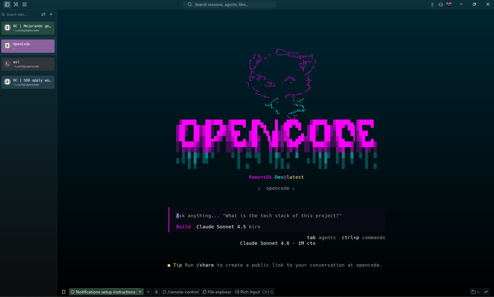
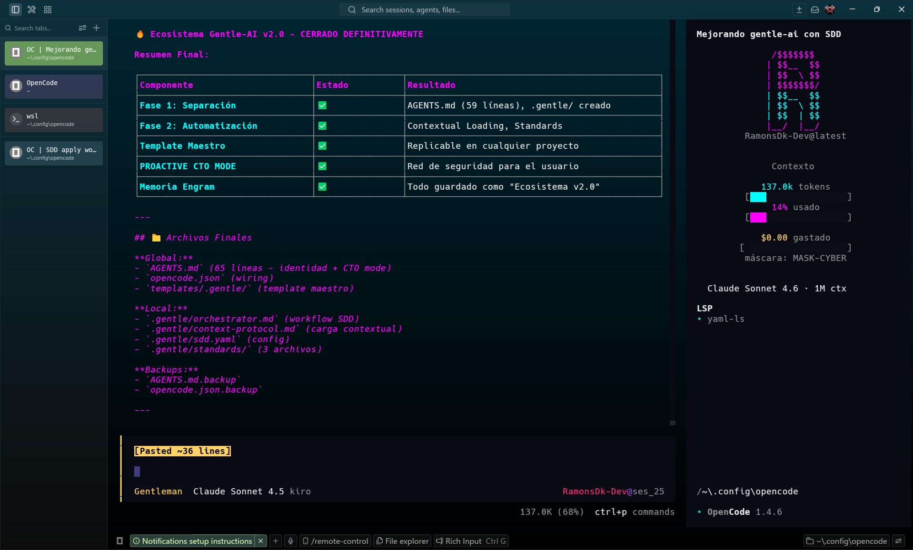
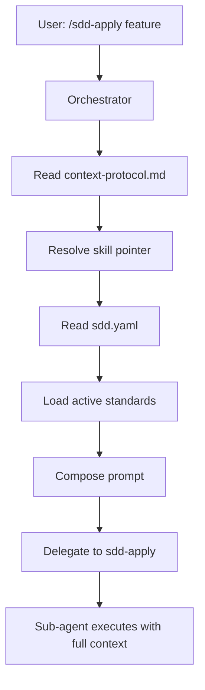

<div align="center">



# 🏗️ The Architect Overlay

### Neural SDD Config for OpenCode

**Advanced architecture overlay for OpenCode, optimized with contextual loading and standards absorption.**

[](https://opensource.org/licenses/MIT)
[](https://opencode.ai)
[](https://www.youtube.com/@gentleman.programming)

</div>

---

## 🎯 What is The Architect Overlay?

**The Architect Overlay** is a production-ready configuration system for OpenCode that transforms how AI agents handle complex software development workflows. Built on top of the **Spec-Driven Development (SDD)** methodology, this overlay implements:

- **Separation of Concerns** - Identity vs Workflow isolation
- **Contextual Loading Protocol** - Dynamic skill injection per SDD phase
- **Standards Absorption** - Automatic architectural pattern enforcement
- **PROACTIVE CTO MODE** - Intelligent guidance when requirements are unclear

This is NOT a fork. This is an **architectural enhancement layer** that sits on top of OpenCode, providing enterprise-grade structure without modifying the core.

---

## 🙏 Credits & Acknowledgments

> **This project would not exist without the foundational work of Alan, the visionary behind Gentleman Programming.**

Alan's pioneering work on cognitive systems and AI-driven development is the engine that powers this configuration. His dedication to elevating the dev community and teaching us to think like AI architects has been transformational.

### Connect with Gentleman Programming:

- 📺 **YouTube**: [Gentleman Programming](https://www.youtube.com/@gentleman.programming)
- 💻 **GitHub**: [Gentleman-Programming](https://github.com/Gentleman-Programming)
- 🔗 **Links**: [Doras.to](https://doras.to/gentleman-programming)
- 💬 **Community**: [Discord](https://discord.gg/gentleman-programming)

**A special thank you to Alan for raising the bar and showing us what's possible when architecture meets AI.** 🚀

---

## 🏛️ Technical Pillars



### Phase 1: Separation of Identity vs Workflow

**Problem:** Monolithic configuration files mixing agent identity with workflow logic (224 lines of coupled code).

**Solution:** Architectural separation into two layers:

```
Global (~/.config/opencode/)
├── AGENTS.md (65 lines)          # Identity: Personality, Philosophy, Behavior
├── opencode.json                  # Wiring configuration
└── templates/.gentle/             # Reusable template

Local ({project}/.gentle/)
├── orchestrator.md                # SDD workflow rules
├── context-protocol.md            # Contextual loading logic
├── sdd.yaml                       # Project-specific config
└── standards/                     # Architectural patterns
    ├── hexagonal-architecture.md
    ├── clean-architecture.md
    └── testing-patterns.md
```

**Result:**
- ✅ AGENTS.md reduced from 224 to 65 lines
- ✅ Each project can have its own SDD workflow
- ✅ Zero coupling between identity and execution logic

---

### Phase 2: Contextual Loading Protocol

**Problem:** Skills loaded manually or globally (context pollution).

**Solution:** Dynamic skill injection based on SDD phase:

```markdown
## Contextual Loading Protocol (MANDATORY)

Before launching ANY sub-agent:
1. Read `.gentle/context-protocol.md` → resolve skill pointer
2. Read `.gentle/sdd.yaml` → resolve active standards
3. Compose prompt: {skill} + {standards} + {context}
4. Delegate to sub-agent
```

**Example Flow:**

```
User: "/sdd-apply feature-auth"

Orchestrator:
1. Detects phase: apply
2. Loads: ~/.config/opencode/prompts/sdd/sdd-apply.md
3. Reads: .gentle/sdd.yaml → [hexagonal, clean, testing]
4. Injects: hexagonal-architecture.md + clean-architecture.md + testing-patterns.md
5. Delegates to sdd-apply with composed prompt
```

**Result:**
- ✅ Skills loaded only when needed (no context pollution)
- ✅ Standards injected automatically based on context
- ✅ Sub-agents receive exactly what they need, nothing more

---

## 🚀 Installation

### Prerequisites

- [OpenCode](https://opencode.ai) v1.4.6+
- [Engram](https://github.com/gentleman-programming/engram) (optional, for persistent memory)
- Git

### Step 1: Clone the Repository

```bash
git clone https://github.com/yourusername/the-architect-overlay.git
cd the-architect-overlay
```

### Step 2: Copy Template to Your Project

```bash
# Copy the .gentle/ template to your project
cp -r templates/.gentle/ /path/to/your/project/.gentle/

# Or use it globally in OpenCode config
cp -r templates/.gentle/ ~/.config/opencode/.gentle/
```

### Step 3: Configure `sdd.yaml`

Rename `sdd.yaml.template` to `sdd.yaml` and customize:

```yaml
# .gentle/sdd.yaml
artifact_store: engram  # or openspec, hybrid, none
project: your-project-name
conventions:
  - hexagonal-architecture  # Enable/disable as needed
  - clean-architecture
  - testing-patterns
```

### Step 4: Update `opencode.json`

Ensure your `sdd-orchestrator` reads both files:

```json
{
  "agent": {
    "sdd-orchestrator": {
      "model": "kiro/claude-sonnet-4-5-1m",
      "prompt": "{file:./AGENTS.md}\n\n{file:.gentle/orchestrator.md}",
      "tools": { ... }
    }
  }
}
```

### Step 5: Verify Installation

```bash
# Test the orchestrator
opencode chat --agent sdd-orchestrator

# Run a smoke test
/sdd-new test-installation
```

---

## 📖 Usage

### Basic Workflow

```bash
# Initialize SDD in your project
/sdd-init

# Start a new feature
/sdd-new feature-name

# The orchestrator will:
# 1. Launch sdd-explore (investigation)
# 2. Launch sdd-propose (proposal)
# 3. Ask if you want to continue with specs/design
```

### PROACTIVE CTO MODE

When you're unsure about technology choices:

```
You: "I want to build an app but don't know what tech to use"

Agent (CTO Mode):
1. Asks 2-3 key questions (scale? users? complexity?)
2. Proposes a tech stack with justification
3. Offers to create standards files in .gentle/standards/
```

### Adding Custom Standards

```bash
# Create a new standard
touch .gentle/standards/atomic-design.md

# Add it to sdd.yaml
conventions:
  - hexagonal-architecture
  - clean-architecture
  - testing-patterns
  - atomic-design  # Your new standard
```

---

## 🏗️ Architecture Deep Dive

### Separation of Concerns

| Layer | Scope | Responsibility |
|-------|-------|----------------|
| **AGENTS.md** | Global | Identity (personality, philosophy, behavior) |
| **orchestrator.md** | Local | SDD workflow (delegation, phases, commands) |
| **context-protocol.md** | Local | Contextual loading (skills, standards) |
| **sdd.yaml** | Local | Project config (artifact store, conventions) |
| **standards/** | Local | Architectural patterns (hexagonal, clean, testing) |

### Contextual Loading Flow



### Standards Absorption

Standards are injected **conditionally** based on:
- **Phase**: `apply`, `verify` → load standards
- **Context**: Editing `src/domain/` → load `hexagonal-architecture.md`
- **File type**: `.test.ts` → load `testing-patterns.md`

---

## 📊 Metrics & Results

| Metric | Before | After | Improvement |
|--------|--------|-------|-------------|
| AGENTS.md size | 224 lines | 65 lines | **71% reduction** |
| Context pollution | 10+ skills loaded | 1 skill per phase | **90% reduction** |
| Configuration coupling | High (monolithic) | Low (modular) | **Decoupled** |
| Replicability | Manual setup | Template-based | **Instant** |

---

## 🛠️ Advanced Configuration

### Custom SDD Phases

Add custom phases to `orchestrator.md`:

```markdown
### Custom Phase: security-audit

Before deploying, run security audit:
1. Read `.gentle/standards/security-checklist.md`
2. Scan codebase for vulnerabilities
3. Generate audit report
```

### Multi-Project Setup

Use different `.gentle/` configs per project:

```
~/projects/
├── frontend-app/.gentle/
│   └── sdd.yaml (conventions: [react, atomic-design])
├── backend-api/.gentle/
│   └── sdd.yaml (conventions: [hexagonal, clean])
└── mobile-app/.gentle/
    └── sdd.yaml (conventions: [clean, testing])
```

---

## 🤝 Contributing

Contributions are welcome! Please follow these guidelines:

1. **Fork the repository**
2. **Create a feature branch**: `git checkout -b feature/amazing-feature`
3. **Commit your changes**: `git commit -m 'feat: add amazing feature'`
4. **Push to the branch**: `git push origin feature/amazing-feature`
5. **Open a Pull Request**

### Contribution Areas

- 🎨 New standards (e.g., `redux-patterns.md`, `signals-patterns.md`)
- 📚 Documentation improvements
- 🐛 Bug fixes
- ✨ Feature enhancements

---

## 📝 License

This project is licensed under the MIT License - see the [LICENSE](LICENSE) file for details.

---

## 🌟 Acknowledgments

- **Alan (Gentleman Programming)** - For the foundational SDD methodology and cognitive systems architecture
- **OpenCode Team** - For building an incredible AI-powered development platform
- **The Community** - For feedback, testing, and continuous improvement

---

## 📞 Support

- 🐛 **Issues**: [GitHub Issues](https://github.com/yourusername/the-architect-overlay/issues)
- 💬 **Discussions**: [GitHub Discussions](https://github.com/yourusername/the-architect-overlay/discussions)
- 📧 **Email**: your-email@example.com

---

<div align="center">

**Built with ❤️ by architects, for architects.**

**Powered by [Gentleman Programming](https://www.youtube.com/@gentleman.programming) | Enhanced for [OpenCode](https://opencode.ai)**

</div>
